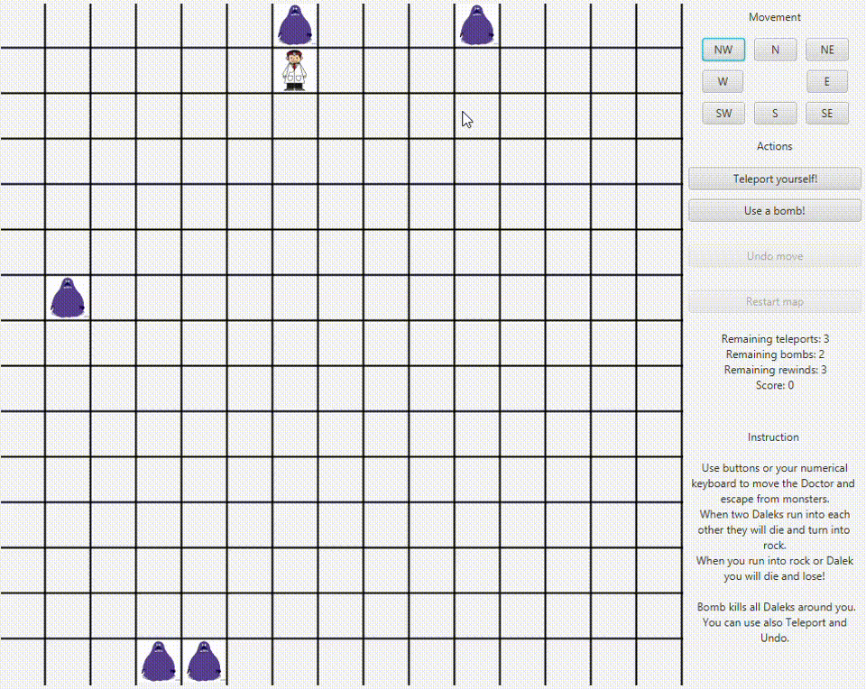

# Daleki Project
Developed by:
- Krzysztof Widenka, [@krzwid](https://github.com/krzwid)
- Patryk Skupień, [@skupien](https://github.com/skupien)
- Natalia Brzozowska, [@brzozia](https://github.com/brzozia)

This is a project made for object oriented programming classes in a three-person team.
Project was developed on bitbucket and this repository is a copy of completed project thus it lacks commit and branches history.

# Daleks Game

<b>Daleks Game</b> is a turn-based game where you are controlling a Doctor.  On the map you can spot three types of objects:  
<i>Doctor</i> – this is your character,  
<i>Daleks</i> – enemies that try to eat our doctor. Every time the doctor moves, each Dalek moves towards him,  
<i>Destroyed Daleks</i> – whenever Dalek is destroyed, he becomes an immovable object. Doctor and Daleks are destroyed if they bump into one.
  
Objective is to get rid of all alive Daleks from map. To achieve this, you must move the doctor in such a way, that two Daleks will go to the same tile, thus creating a destroyed Dalek. 
Doctor can move in 8 directions and also use one of three power-ups – teleportation to random spot, bomb that destroys Daleks on eight adjacent tiles and undoing a previous move. You can have only up to three of each powerup and you get one of each for completing a map. 
Every time you complete a map, your score increases and the game restarts with one more Dalek on a map.
   
CONTROLS: 
You can use movement buttons appearing on the right side of a window or use numerical keypad in a corresponding way: 
7  8  9  
4  _  6  
1  2  3  
Powerup controls: 
“5” or “t” teleports you, 
“b” uses a bomb, 
“h” allows you to undo move, 
“r” resets a game after losing or winning. 
  
### Sample gameplay:

